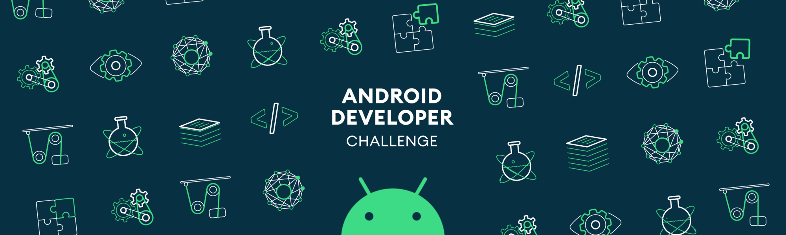

### Deep A/B Testing 
From the title I hope you get the point of this idea! Also in some interviews I explained it to grab some attention, 
so you may have heard about it. By the way, I can explain it anyway! First, let me explain what is an A/B test. 
The idea of A/B testing is that you create some virtual branches in your code, where you can control switching 
between these branches remotely. So you can remotely distribute different branches to people, and measure some 
conversions of events to find out which branch is more suitable for the **majority** of users. After that you find 
out this branch is the winner, you would remove the other branches with the same base(Think of base like what we have 
in git) all together, so every user would use the winner branch. Hah! What about the users who are in **minorities** 
and the removed branches are their perfect choices? YOU WILL LOSS THEM in some levels!

Another aspect of this idea is deep learning. You may know the deep learning is so suite to human’s non-linear 
behaviour, so with this simple argument I fall to think about just using deep learning and TensorFlowLite in this project.

Finally, the idea here is to let the machine learning model fragments your user to use the combination of those 
branches.

### Features and Labels

If you’re familiar with how people teach some behaviours to a supervised model, then you know there are two kinds 
of parameters there. Some parameters are input, where you know them before asking the model to predict something 
for you, which we call them features, and there are output parameters where you want to predict with this model, 
which we call them labels. In this idea, the labels are clear. The number of branches is the number of labels. 
This is the set of numbers that we want to predict for an individual person on his/her device. The features can 
be different events and logs in your app, where the model needs to generate the prediction.

To implement a sample app I can think about the following scenario. We have three pages, A, B, and C. The page A 
is the launching page where user can go to page B or page C from the page A. So the page B and C are in different 
virtual branches. The label data is as simple as choosing between these two pages, so we need two labels. 
To create features, we can have, for instance, 10 buttons in the page A, and a happy button, which is the goal, 
in each of page B and C. Each button has one feature for if they get a click, also the user’s happiness is the last 
feature, where all together are 11 features. Of course the user can go back from page B and C by pressing the back 
button of the device, which we don’t want, because probably he/she is not happy about our page :D The model would learn 
from user’s behaviour and try to make him/her happy by creating a row of features and labels in a dataset, where 
basically the model can learn it. So every time the user gets happy or not-happy, the model would learn about his 
behaviour and suggests different set of labels for user. That’s it.

In the end, this idea can be extended to become a library. In that library the developer needs to annotate fields 
of some data classes to be feature or label, then the library would generate some methods to answer questions 
about choosing different branches. Or a little more complicated than that ;) so every app can be smart. Mmm, 
if I was good at selling I would name the idea smart apps :D

Finally, Google can say they’re interested and review my code to stick to the best performance and other good 
stuff that you know better than anyone.

The timeline! Mmm! Don’t have one.

### The developer behind this idea
 
He is an Android developer in Letgo, who enjoys learning. You can find his [resume](https://github.com/hadilq/cv-english/blob/master/cv-public-lashkari.pdf) 
here, but to explain his motivation, learning and solving Mathematical problems brings him the most joy, 
for instance in his spare time, he learns about Functional Programming, Category Theory, Derivative Programming, 
Machine Learning, Theoretical Physics, etc.

